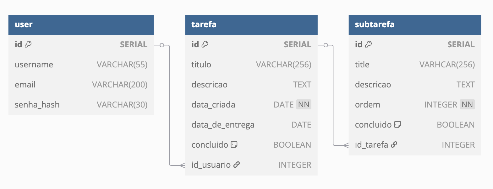
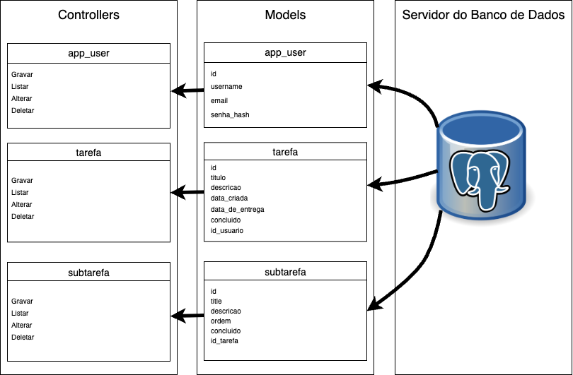
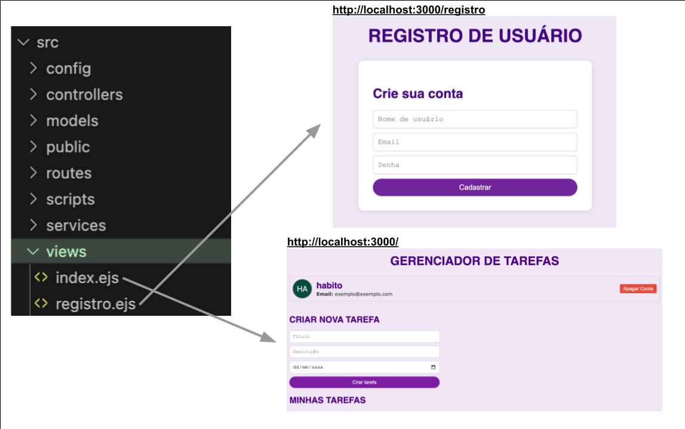

# Web Application Document - Projeto Individual - Módulo 2 - Inteli

## Nome do projeto

#### Autor do projeto

Daniel Meiches

## Sumário

1. [Introdução](#c1)  
2. [Visão Geral da Aplicação Web](#c2)  
3. [Projeto Técnico da Aplicação Web](#c3)  
4. [Desenvolvimento da Aplicação Web](#c4)  
5. [Referências](#c5)  

<br>

## <a name="c1"></a>1. Introdução (Semana 01)

O projeto que vou desenvolver será um sistema de gerenciamento de projetos. Nele, o usuário poderá criar tarefas e criar atributos (ou subtarefas) que serão incrementos para o desenvolvimento da tarefa principal. O sistema será desenvolvido com Javascript, SQL, HTTL e HTTP e poderá ser rodado através do Node.

---

## <a name="c2"></a>2. Visão Geral da Aplicação Web

### 2.1. Personas (Semana 01 - opcional)

*Posicione aqui sua(s) Persona(s) em forma de texto markdown com imagens, ou como imagem de template preenchido. Atualize esta seção ao longo do módulo se necessário.*

### 2.2. User Stories (Semana 01 - opcional)

*Posicione aqui a lista de User Stories levantadas para o projeto. Siga o template de User Stories e utilize a referência USXX para numeração (US01, US02, US03, ...). Indique todas as User Stories mapeadas, mesmo aquelas que não forem implementadas ao longo do projeto. Não se esqueça de explicar o INVEST de 1 User Storie prioritária.*

---

## <a name="c3"></a>3. Projeto da Aplicação Web

### 3.1. Modelagem do banco de dados  (Semana 3)

#### MODELO RELACIONAL:



Esse modelo contém 3 tabelas, que guardarão informações relevantes para o meu sistema de gerenciamento individual. A primeira delas é a ```user```, que contém informações do usuário como seu username, email e senha na forma de hash. A segunda tabela, ```tarefa```, conterá informações de uma tarefa principal que o usuário criará, como título e descrição, data criada, data de entrega e se a tarefa foi concluída. Por último, a tabela ```subtarefa``` tem informações de tarefas contidas dentro das tarefas principais, que são título e descrição, ordem numérica da subtarefa e se foi concluída.

As 3 tabeles contém um atributo ```id``` que funcionará como a chave primária. As tabelas ```tarefa``` e ```subtarefa``` tem chaves estrangeiras que as conectarão às tabelas ```user``` e ```tarefa```, respectivamente.

A relação entre as tabelas ```user``` e ```tarefa``` é 1:N e a relação entre as tabelas ```tarefa``` e ```subtarefa``` é 1:N. Isso quer dizer que um usuário consegue criar várias tarefas, assim como dentro de uma tarefa, várias subtarefas podem ser criadas.

#### MODELO FÍSICO:
```
CREATE TABLE IF NOT EXISTS app_user (
  id SERIAL PRIMARY KEY,
  username VARCHAR(55),
  email VARCHAR(200),
  senha_hash VARCHAR(30)
);

CREATE TABLE IF NOT EXISTS tarefa (
  id SERIAL PRIMARY KEY,
  titulo VARCHAR(256),
  descricao TEXT,
  data_criada DATE NOT NULL,
  data_de_entrega DATE,
  concluido BOOLEAN DEFAULT FALSE,
  id_usuario INTEGER,
  FOREIGN KEY (id_usuario) REFERENCES app_user(id)
);

CREATE TABLE IF NOT EXISTS subtarefa (
  id SERIAL PRIMARY KEY,
  title VARCHAR(256),
  descricao TEXT,
  ordem INTEGER NOT NULL,
  concluido BOOLEAN DEFAULT FALSE,
  id_tarefa INTEGER,
  FOREIGN KEY (id_tarefa) REFERENCES tarefa(id)
);
```

### 3.1.1 BD e Models (Semana 5)

#### Modelo do Usuário:

- ```id```: PK
- ```username```: o nome que o usuário definiu para si mesmo no sistema.
- ```email```: o email que o usuário inseriu para fazer login.
- ```senha_hash```: representação alfanumérica de comprimento fixo da senha do usuário.


#### Modelo de Tarefa:

- ```id```: PK
- ```titulo```: título que o usuário definiu para certa tarefa.
- ```descricao```: descrição que o usuário definiu para certa tarefa.
- ```data_criada```: data que a tarefa foi criada.
- ```data_de_entrega```: prazo para entrega da tarefa que o usuário definiu, caso aplicável.
- ```concluido```: valor booleano que definirá se a tarefa foi concluída.
- ```id_usuario```: FK que referencia o ```id``` no modelo do usuário.


#### Modelo de Subtarefa:

- ```id```: PK
- ```title```: título para a subtarefa de uma certa tarefa.
- ```descricao```: descrição que o usuário definiu para certa subtarefa.
- ```ordem```: um número que indicará a ordem de prioridade da subtarefa.
- ```concluido```: valor booleano que definirá se a subtarefa foi concluída.
- ```id_tarefa```: FK que referencia o ```id``` no modelo da tarefa.


### 3.2. Arquitetura (Semana 5)

Nessa entrega, foram feitas as camadas Model e Controller. As views serão configuradas na próxima entrega, por isso não estão incluídas nessa versão do diagrama:



### 3.3. Wireframes (Semana 03 - opcional)

*Posicione aqui as imagens do wireframe construído para sua solução e, opcionalmente, o link para acesso (mantenha o link sempre público para visualização).*

### 3.4. Guia de estilos (Semana 05 - opcional)

*Descreva aqui orientações gerais para o leitor sobre como utilizar os componentes do guia de estilos de sua solução.*


### 3.5. Protótipo de alta fidelidade (Semana 05 - opcional)

*Posicione aqui algumas imagens demonstrativas de seu protótipo de alta fidelidade e o link para acesso ao protótipo completo (mantenha o link sempre público para visualização).*

### 3.6. WebAPI e endpoints (Semana 05)

#### Endpoints do Usuários

- POST /api/app_users
Criação de um usuário. Exemplo de corpo da requisição:
```
{
  "username": "taskmaster4",
  "email": "adorotarefas@exemplo.com",
  "senha_hash": "0123senh4"
}
```

- GET /api/app_users
Mostra lista de todos os usuários cadastrados no sistema.

- PUT /api/app_users/:id
Atualiza algum campo de informação do usuário com base no seu ID.

- DELETE /api/app_users/:id
Apaga a conta de um usuário com base no seu ID.

#### Endpoints da Tarefa

- POST /api/tarefas
Criação de uma tarefa. Exemplo de corpo da requisição:
```
{
  "titulo": "Atividade Ponderada",
  "descricao": "Preciso entregar uma atividade ponderada de programação",
  "data_criada": "2025-05-22",
  "data_de_entrega": "2025-06-01",
  "concluido": false,
  "id_usuario": 1
}
```

- GET /api/tarefas
Mostra lista de todas tarefas criadas por um usuário (é possível qual tarefa pertence a um certo usuário pelo ID do usuário).

- PUT /api/tarefas/:id
Atualiza algum campo de informação da tarefa com base no seu ID.

- DELETE /api/tarefas/:id
Apaga uma tarefa com base no seu ID.

#### Endpoints da Subtarefa

- POST /api/subtarefas
Criação de uma subtarefa. Exemplo de corpo da requisição:
```
{
  "title": "Acabar a documentação",
  "descricao": "Vou acabar a documentação do WAD",
  "ordem": 1,
  "concluido": false,
  "id_tarefa": 1
}
```

- GET /api/subtarefas
Mostra lista de todas subtarefas criadas por um usuário (é possível qual subtarefa pertence a uma certa tarefa pelo ID da tarefa).

- PUT /api/subtarefas/:id
Atualiza algum campo de informação da subtarefa com base no seu ID.

- DELETE /api/subtarefas/:id
Apaga uma subtarefa com base no seu ID.

### 3.7 Interface e Navegação (Semana 07)

O código que eu fiz para ter um frontend funcional foi separado em duas pastas com arquivos de formatos diferentes:
```
📁 src
├── 📁 views
│   ├── index.ejs
│   ├── registro.js
└── 📁 public
    ├── styles.css
    ├── tarefas.js
    ├── subtarefas.js
    └── usuario.js
```
A pasta views conterá dois arquivos ejs, que contém códigos em html configurando as duas páginas do meu sistema:


A pasta public contém arquivos javascript para que as funcionalidades do sistema funcionem. Funcionalidades incluem:
- criação de tarefas através de um método POST. Trecho de código vem do arquivo ```tarefas.js```:
```
form.addEventListener('submit', async (e) => {
    e.preventDefault();

    const novaTarefa = {
      titulo: document.getElementById('titulo').value,
      descricao: document.getElementById('descricao').value,
      data_criada: new Date().toISOString().split('T')[0],
      data_de_entrega: document.getElementById('data_de_entrega').value,
      concluido: false,
      id_usuario: ID_USUARIO,
    };

    await fetch('/api/tarefas', {
      method: 'POST',
      headers: { 'Content-Type': 'application/json' },
      body: JSON.stringify(novaTarefa),
    });

    form.reset();
    carregarTarefas();
  });
```
- edição de tarefas através de um método PUT. Trecho de código vem do arquivo ```tarefas.js```:
```
 document.querySelectorAll('.editar-tarefa').forEach(btn => {
    btn.addEventListener('click', () => {
      const li = btn.closest('li');
      const id = btn.dataset.id;

      const tituloStrong = li.querySelector('strong');
      const descLine = li.querySelector('.tarefa-descricao');
      const entregaLine = [...li.childNodes].find(n => n.textContent?.includes('Entrega:'));
      const statusLine = [...li.childNodes].find(n => n.textContent?.includes('Status:'));

      const inputTitulo = document.createElement('input');
      inputTitulo.value = tituloStrong.textContent;

      const inputDescricao = document.createElement('input');
      inputDescricao.value = descLine.textContent.trim();

      const inputDataEntrega = document.createElement('input');
      inputDataEntrega.type = 'date';
      inputDataEntrega.value = entregaLine.textContent.split('Entrega: ')[1].trim().split('/').reverse().join('-');

      const checkboxConcluido = document.createElement('input');
      checkboxConcluido.type = 'checkbox';
      checkboxConcluido.checked = statusLine.textContent.includes('Concluído');

      const statusLabel = document.createElement('label');
      statusLabel.style.display = 'flex';
      statusLabel.style.alignItems = 'center';
      statusLabel.style.gap = '8px';
      statusLabel.textContent = 'Status: ';
      statusLabel.appendChild(checkboxConcluido);

      const salvarBtn = document.createElement('button');
      salvarBtn.className = 'icon-btn';
      salvarBtn.title = 'Salvar';
      salvarBtn.innerHTML = '<i data-feather="check"></i>';

      const excluirBtn = li.querySelector('.excluir-tarefa');
      const descartarBtn = document.createElement('button');
      descartarBtn.className = 'icon-btn';
      descartarBtn.title = 'Descartar alterações';
      descartarBtn.innerHTML = '<i data-feather="x"></i>';
      descartarBtn.style.marginLeft = '10px';

      tituloStrong.replaceWith(inputTitulo);
      descLine.replaceWith(inputDescricao);
      entregaLine.replaceWith(inputDataEntrega);
      statusLine.replaceWith(statusLabel);
      btn.replaceWith(salvarBtn);
      excluirBtn.replaceWith(descartarBtn);

      feather.replace();

      salvarBtn.addEventListener('click', async () => {
        await fetch(`/api/tarefas/${id}`, {
          method: 'PUT',
          headers: { 'Content-Type': 'application/json' },
          body: JSON.stringify({
            titulo: inputTitulo.value,
            descricao: inputDescricao.value,
            data_de_entrega: inputDataEntrega.value,
            concluido: checkboxConcluido.checked
          })
        });

        carregarTarefas();
      });
```
- adição de subtarefas através de um método POST. Trecho de código vem do arquivo ```subtarefas.js```:
```
orm.addEventListener('submit', async (e) => {
      e.preventDefault();

      const idTarefa = parseInt(form.dataset.id);
      const formData = new FormData(form);

      const novaSubtarefa = {
        title: formData.get('title'),
        descricao: formData.get('descricao'),
        ordem: 1,
        concluido: false,
        id_tarefa: idTarefa,
      };

      await fetch('/api/subtarefas', {
        method: 'POST',
        headers: { 'Content-Type': 'application/json' },
        body: JSON.stringify(novaSubtarefa),
      });

      form.reset();
      carregarTarefas();
    });
```
- apagamento de um usuário através de um método DELETE. Trecho de código vem do arquivo ```tarefas.js```:
```
    document.getElementById('delete-account-btn').onclick = async () => {
        try {
            const res = await fetch(`/api/app_users/${usuario.id}`, { method: 'DELETE' });

            if (res.ok) {
                localStorage.removeItem('usuario');
                window.location.href = '/registro';
            } else {
                const erro = await res.json();
                alert('Erro ao apagar conta: ' + (erro.error || 'Erro desconhecido'));
            }
        } catch (err) {
            alert('Erro ao apagar conta: ' + err.message);
        }
    };
```
- arquivo ```usuario.js``` que vai checar se um usuário existe. Caso não existir, o cliente será direcionado para a tela de login:
```
window.usuario = JSON.parse(localStorage.getItem('usuario'));

if (!window.usuario) {
  window.location.href = '/registro';
}
```

## <a name="c4"></a>4. Desenvolvimento da Aplicação Web (Semana 8)

### 4.1 Demonstração do Sistema Web (Semana 8)

*VIDEO: Insira o link do vídeo demonstrativo nesta seção*
*Descreva e ilustre aqui o desenvolvimento do sistema web completo, explicando brevemente o que foi entregue em termos de código e sistema. Utilize prints de tela para ilustrar.*

### 4.2 Conclusões e Trabalhos Futuros (Semana 8)

*Indique pontos fortes e pontos a melhorar de maneira geral.*
*Relacione também quaisquer outras ideias que você tenha para melhorias futuras.*


## <a name="c5"></a>5. Referências

_Incluir as principais referências de seu projeto, para que o leitor possa consultar caso ele se interessar em aprofundar._<br>

---
---